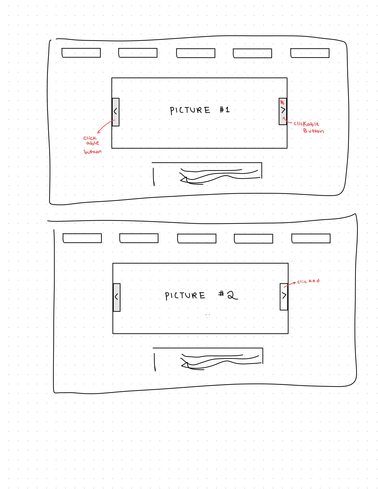
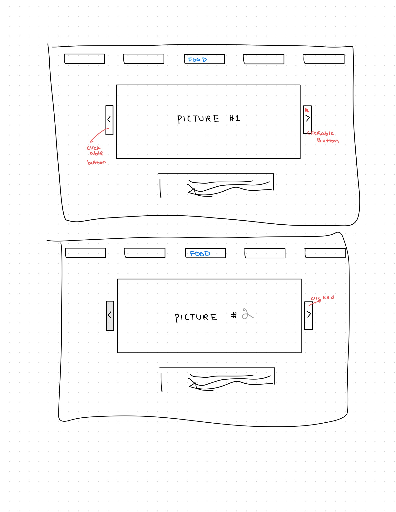
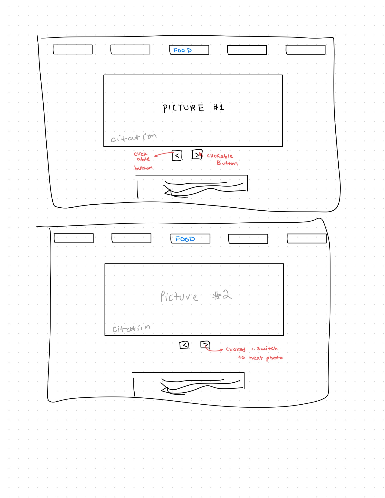
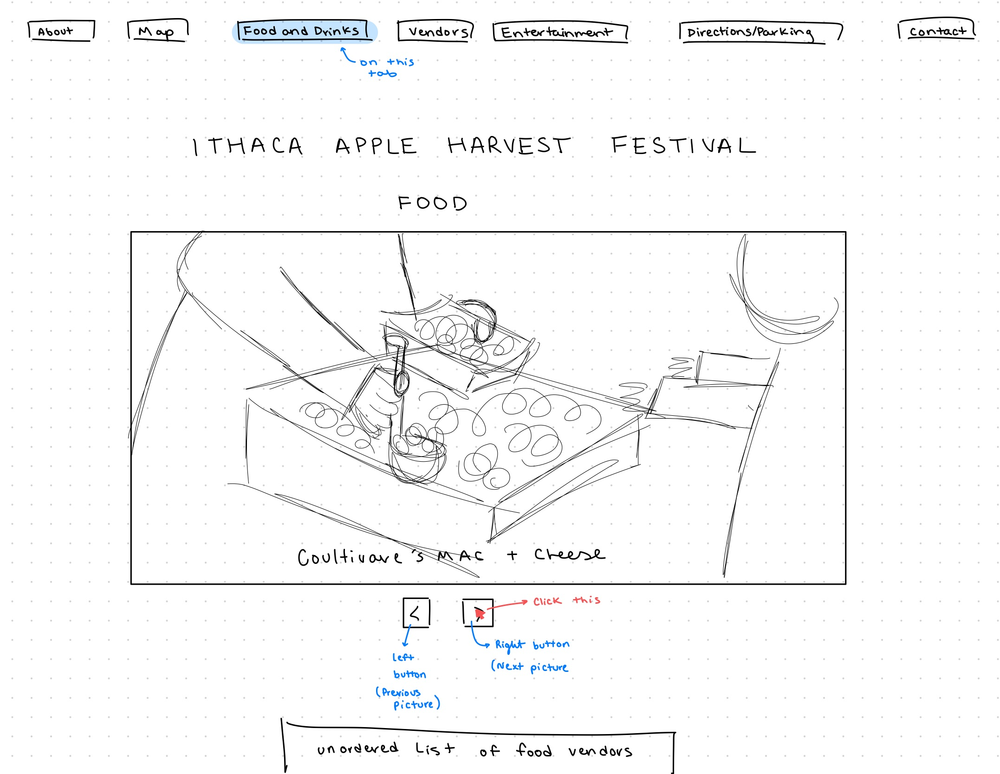
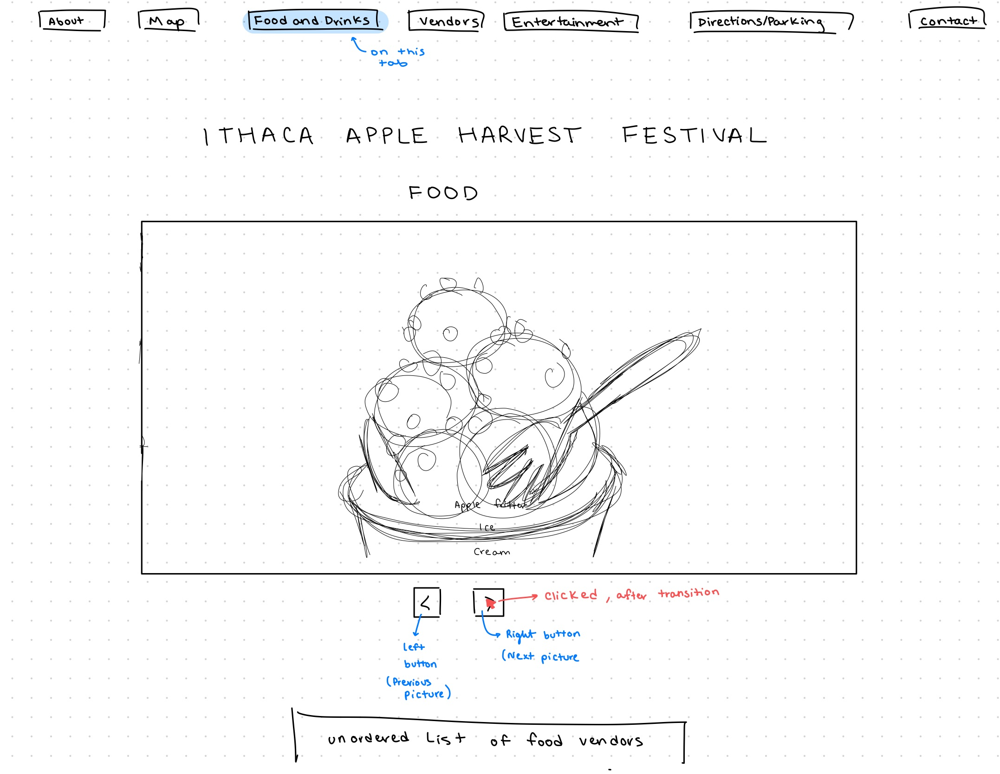

# Project 3: Design Journey

**For each milestone, complete only the sections that are labeled with that milestone.**

**Replace ALL _TODOs_ with your work.** (There should be no TODOs in the final submission.)

Be clear and concise in your writing. Bullets points are encouraged.

**Everything, including images, must be visible in Markdown Preview.** If it's not visible in Markdown Preview, then we won't grade it. We won't give you partial credit either. This is your warning.


# Existing Project

**Tell us about the project you'll be using for Project 3.**

## Project (Milestone 1)
> Which project will you add interactivity to enhance the site's functionality?

Project 2


## Audience (Milestone 1)
> Who is your project site's audience?
> This should be the original audience from Project 1 or Project 2.
> You should adjust the audience if necessary. Just make sure you explain your rationale for doing so here.

As this website is about the Apple Harvest Festival in Ithaca, the audience for this site will be people likely in the Ithaca community specifically college-aged students from Ithaca College and Cornell University. They all share the same location and basic understanding of Ithaca so especially for the transportation section, it'll be easier to plan out and provide accurate information. Operating hours can take place in EST. This age range for this audience is primarily around 18-22 so I'd want to make sure it's usable to all ages on both desktop and phones. At the festival, people of this age are more likely to use their phones to access the website and more likely to use their desktop to access the website beforehand and afterward.


## Audience's Goals (Milestone 1)
> List the audience's goals that you identified in Project 1 or 2.
> Just list each goal. No need to include the "Design Ideas and Choices", etc. You may adjust the goals if necessary. However, any changes you make to the goals for this project should be clearly identified and justified.

- Goal 1: Provide the operating hours of Apple Harvest Fest/"Tradition"
- Goal 2: Provide information about to Parking/Transportation
- Goal 3: Provide information on Food and Craft Vendors / Products present and sold at the Festival
- Goal 4: Maps and navigating the fair while there


# Interactivity Design

## Interactivity Brainstorm (Milestone 1)
> Using the audience goals you identified, brainstorm possible options for interactivity to enhance the functionality of the site while also assisting the audience with their goals.
> Briefly explain idea each idea and provide a brief rationale for how the interactivity enhances the site's functionality for the audience.
> Note: You may find it easier to sketch for brainstorming. That's fine too. Do whatever you need to do to explore your ideas.

- Idea 1: When the mouse hovers over the food vendors and craft vendors navigation tab, a dropdown list of all the vendors will appear. Clicking on any of the links will cause the website to redirect the user to the main website page of the vendor.
- Idea 2: A pop up of the location of the venue and the operating hours will pop up when the user first gets to the page.
- Idea 3: When the mouse is hovered over a navigation bar or any ahref link -- change the color of the text to a lighter shade of brown.
- Idea 4: Slideshow of pictures from apple fest on the homepage
- Idea 5: Slideshow of pictures for food instead of having three pictures in a row
- Idea 6: Slideshow of pictures for vendors and performances rather than just having one.


## Interactivity Proposal & Rationale (Milestone 1)
> Make a decision about your site's interactivity. Explain what you plan to implement and where it will go on your site.
> Describe the purpose of your proposed interactivity. Provide a brief rationale explaining how your proposed interactivity addresses the goals of your site's audience.

**Interactivity Proposal:**

Slideshow/Carousel of pictures for food and drinks instead of having three pictures in a row for the desktop version and a vertical scroll for the mobile version.

**User Goals Rational:**

All pictures can be displayed bigger and it will not take up as much navigation length-wise when displayed on a mobile device. Arrows pointing left and right can switch the photo in the slide deck.

## Interactivity Design Ideation (Milestone 1)
> Now that you've made a decision about the site's interactivity, explore the possible design solutions for the interactivity.
> Sketch several iterations of your interactivity.
> Annotate each sketch explaining what happens when a user takes an action. (e.g. When user clicks this, this happens.)

Sketch/Design 1

<!-- Source: (original work) Stephanie Zhang -->

If the buttons to navigate left and right are overlapped on top of the picture, this will save room in terms of width but it could be obstructing important parts of the image.


Sketch/Design 2

<!-- Source: (original work) Stephanie Zhang -->

Buttons to the left and right of the main picture. This would be not ideal for mobile screens as the width of the screen is already so limited and now it has to be shared with the width of the Buttons.

Sketch/Design 3

<!-- Source: (original work) Stephanie Zhang -->

Having buttons below the displayed picture not only prevents obstruction of content but also saves the width of the picture displayed.


## Final Interactivity Design (Milestone 1)
> Review your sketches from the previous step and pick your final design.
> Create a _polished_ sketch (it's still a sketch, but with a little more care taken to communicate ideas clearly to the graders) to plan your interactivity.
> **Sketch out the entire page where your interactivity will go.** Add your interactivity to the sketch. Add any annotations to explain what happens when the user takes an action.
> Include as many sketches as necessary to communicate your design (ask yourself, could another 1300 take these sketches an implement my design?)

First step, initial display

<!-- Source: (original work) Stephanie Zhang -->

Immediately after you click this button, the next image wil be displayed and you will see the next picture. This is a complete transition.

<!-- Source: (original work) Stephanie Zhang -->

## "Ambitious" Interactivity Explanation
> In your own words, concisely explain why you believe your interactivity meets the "ambitious" requirement.

I want to implement a carousel of photos for food and drinks because one of the major reasons users of the website said they attended apple fest was because of the food. In the original design without interactivity, the pictures are only set to 33% width and displayed in a horizontal row for the desktop version and required scrolling past 3 individual pictures for the mobile design. With a carousel, users are able to enjoy all pictures at maximum width and clarity without having to scroll through a lot of length-wise content on the mobile device. A carousel saves space while still allowing users to view photos at maximum clarity. A carousel is an example of the "ambitious" interactivities so it fulfils that part of the project expectations.


## Additional Information (Milestone 1)
> (optional) Include any additional information, justifications, or comments we should be aware of.

N/A


# Interactivity Implementation Plan (Final Submission)

## HTML Interactivity Plan (Final Submission)
> Plan the HTML elements you will use in your interactivity.
> For each element, give its `id=` (if it has one) and any default styling (`class=`)

- right button: `<button type="button" id = "fbprev">&lt;</button>`
- left button:`<button type="button" id = "fbnext">&lt;</button>`
- a button row (to keep the left and right button next to each other): `<div class='buttonrow'>`
- picture 1's dot button:`<button type="button" class = current id = "ffirst ">o</button>`
- picture 2's dot button:`<button type="button" id = "fsecond ">o</button>`
- picture 3's dot button:`<button type="button" id = "fthird ">o</button>`
- picture 1 and its citation of carousel: `<div id = fpic_1 class = "pictureandcitation">`
- picture 2 and its citation of carousel: `<div id = fpic_2 class = "pictureandcitation, hidden">`
- picture 3 and its citation of carousel: `<div id = fpic_3 class = "pictureandcitation, hidden">`
- The entire area for the carousel to style the pictures together: `<div class = "picsgroup">`


## CSS Interactivity Plan (Final Submission)
> Plan the CSS classes you will need for your interactivity

- `.buttonrow` - display the arrows centered under the photo in a horizontal row
- `.hidden` - hides a picture and it's citation div
- `.picsgroup` - centers the picture displayed in the Carousel
- `.food` - modify it so that it crops photos into a uniform size
- `.hover` - if the mouse is hovered over the button(dots) the color of the button would changed
- `.current` - the color of the button(dot) that indicates the current picture in the carousel has a color change to show that it's currently being displayed
- `.hoverarrow` - if the mouse is hovered over the left and right buttons to indicate a change in picture, the color of the button would changed


## Interactivity Pseudocode (JavaScript) Plan (Final Submission)
> Write your interactivity pseudocode plan here.

This is the same peudocode/logic for both the food and drinks carousels.

```
// displaying the correct pictures
when user clicks #bnext (id):
  if #pic_1 is visible:
    add class hidden to #pic_1
    remove class hidden to #pic_2
    remove class hidden from the dot_1
  if #pic_2 is visible:
    add class hidden to #pic_2
    remove class hidden to #pic_3
  if #pic_3 is visible:
    add class hidden to #pic_3
    remove class hidden to #pic_1


when user clicks #bprev (id):
  if #pic_1 is visible:
    add class hidden to #pic_1
    remove class hidden to #pic_3
  if #pic_2 is visible:
    add class hidden to #pic_2
    remove class hidden to #pic_1
  if #pic_3 is visible:
    add class hidden to #pic_3
    remove class hidden to #pic_2

//dots on the bottom
when user clicks on #ffirst:
  remove class hidden from #pic_1
  add class current to #ffirst
  add class hidden #pic_2
  remove class current from #fsecond
  add class hidden to #pic_3
  remove class current from #fthird

when user clicks on #fsecond:
  remove class hidden from #pic_2
  add class current to #fsecond
  add class hidden #pic_1
  remove class current from #ffirst
  add class hidden to #pic_3
  remove class current from #fthird

when user clicks on #fthird:
  remove class hidden from #pic_3
  add class current to #fthird
  add class hidden #pic_2
  remove class current from #fsecond
  add class hidden to #pic_1
  remove class current from #ffirst

/// hover - dots
when user hovers over #ffirst:
  add class hover to #ffirst
  when not hovering:
    remove class hover from #ffirst

when user hovers over #fsecond:
  add class hover to #fsecond
  when not hovering:
    remove class hover from #fsecond

when user hovers over #fthird:
  add class hover to #fthird
  when not hovering:
    remove class hover from #fthird

/// hover - arrows
when user hovers over #fbprev:
  add class hover to #fbprev
  when not hovering:
    remove class hover from #fbprev

when user hovers over #fbnext:
  add class hover to #fbnext
  when not hovering:
    remove class hover from #fbnext

```

# Grading (Final Submission)

## Interactivity Usability Justification (Final Submission)
> Explain how your design effectively uses affordances, visibility, feedback, and familiarity.

The implementation of this design uses affordance in that the buttons created under the pictures look "clickable" and that a mouse can click it to perform an action. The text on the button indicates direction in which the picture will be switched up. Hover was used to aid the affordance of this interactivity as well. By changing the color of the button as the user hovers their mouse over a button, it further suggests that clicking the button will change something about the page.

The design also incorperated the key characteristics of visibility by making the buttons span a entire width of the picture shown in the carousel below it. By increasing the size of the button and scaling it based on the used interface, users are more likely to see and interact with the button. The bright blue color of the current picture displayed in the carousel further brings the reader's eye to the current slide of the picture as well as curious for what's on the other slides.

The button is designed so that whenever it is clicked, the next picture of the carousel will display while the original one will dissapear. This transition will let the user get a since of what the button does: change the picture displayed on the website. Hovering over certain buttons also changes the color of them to indicate that they are to be interacted with and will bring about change to the website when clicked.

This carousel design overall uses familiarity to it's advantage in that it is a widely implemented design for showcasing many pictures (often with tabs and subtabs linked to the pictures shown). Hovering is a common feature to also suggest to a user that clicking a button will result in a change of the page. This is not only seen in carousels but in all familar and common designs involving buttons with interactivity.


## Additional Design Justifications (Final Submission)
> If you feel like you haven’t fully explained your design choices in the final submission, or you want to explain some functions in your site (e.g., if you feel like you make a special design choice which might not meet the final requirement), you can use the additional design justifications to justify your design choices. Remember, this is place for you to justify your design choices which you haven’t covered in the design journey. Use it wisely. However, you don’t need to fill out this section if you think all design choices have been well explained in the final submission design journey.

I understand there are different designs of placing the arrows for a carousel whether it's next to the displayed picture of under the picture. I believe ideally, that if I were able to make the design responsive, I'd place arrows to the left and right of the displayed picture on a desktop screen and under the picture on a mobile screen. The only concern I had with placing the arrows left and right of the picture displayed on a mobile design was that it would possibly obstruct or further condense the width of the displayed picture. On a desktop screen, however, this would not be as great of a concern. To avoid this issue altogether, I decided to place the buttons under the picture displayed. I understand it's more common to display arrows to the left and right of a picture but placing a button below the picture is also common and helps avoid the aforementioned.

## Tell us What to Grade (Final Submission)
> We aren't re-grading your Project 1 or 2. We are only grading the interactivity you added.
> Tell us where (what page) we can find your interactivity and how to use it.
> **We will only grade what you list here;** if it's not listed, we won't grade it.

Files:

- food.html
- istyle.css
- carousel.js

Interactivity:
Under the Food header on the food.html page, there is one picture displayed (Coultivare Mac and Cheese). The buttons for the interactivity are right below it in grey. Click the button on the left to go to the last picture in the carousel (apple cider donuts) and the button to the right to go to the next picture (apple fritter ice cream).

Under the drink header on the food.html page, there is one picture displayed (Lemonade stand). The buttons for the interactivity are right below it in grey. Click the button on the left to go to the last picture in the carousel (apple cider sitting on ice) and the button to the right to go to the next picture (winery).

Hovering the mouse over the buttons (the ones with "o") will turn them light blue. Clicking them will bring you to the photo in the carousel that is correlated with the order of the o button. When that photo is displayed, the corresponding dot button will display dark blue. Hovering the mouse over the navigation left and right arrows will turn them dark grey.


## Additional Resources/References (Final Submission)
> If you referenced other websites (or sources, including tutorials) on this project, list them here.

N/A


## Self-Reflection (Final Submission)
> This was the first project in this class where you coded some JavaScript. What did you learn from this experience?

Implementing javascript is a step-by-step process that takes time. I also particularly like the emphasis on design with this class because I was able to learn the logistics and uniform background to which real web-developers and project managers use to to manage their products. Building these websites from scratch and implementing them with the aid of the design journey helps with the brainstorm process. I also realized that java script was easier for me to grasp because of my CS 1110 background. This semester, I'm enrolled in 2110 and I've realized that the syntax used for java and javascript are very similar. It also reminded me that while all languages have different syntax, the logic needed to understand what the code does is the same. During lab this past week, I was able to help some of my peers on the assignment and I noticed that breaking down the logic of what I wanted my interactivity to do was a critical part of the process. It's almost like sketching a website but instead breaking down the steps for interactivity and breaking that apart into different sections for this assignment within the function.


> Reflect on how HTML, CSS, and JavaScript together support client-side interactivity. If it's helpful, you can describe your mental model of client-side interactivity or explain how the general idea of showing and hiding content can be used to implement other forms of client-side interactivity beyond what you've done in this project.

HTML is able to lay out all the basic structural and content for a user to utilize. It achieves the main goal of a website user because it provides all the information. However, with only HTML, the information a user is trying to access is difficult to reach because it is not as organized and there is virtually a lack of design. This is when CSS comes in. With the incorporation of CSS, more complex designs are usable by the user and it can practice the principles of affordances, visibility, feedback, and familiarity more. CSS is able to justify the layout of the design depending on which screen is used to use the website. This helps because the screen displays of a website on a desktop and phone are very different and many design sketches that are usable on a desktop are impractical However, with just HTML and CSS, the user has trouble interacting and eliciting a core response to the website. Sometimes a design is changed completely to be more usable with the incorporation of interactivity (such as with a carousel!) and other times, it provides an even better form of organization (navigation bars). JavaScript is incorporated to enhance a user's experience as well as better achieve their goals better.


> Take some time here to reflect on how much you've learned since you started this class. It's often easy to ignore our own progress. Take a moment and think about your accomplishments in this class. Hopefully you'll recognize that you've accomplished a lot and that you should be very proud of those accomplishments!

My web development class in high school transitioned to Online towards the end of the trimester when we started learning JavaScript. Therefore, while most of the previous class material was stuff I'd seen and hadn't mastered, this project really helped me solidify my understanding of basic web development and further inspired my appreciation for all the work that goes into a website. Before taking this class, I mistook design for aesthetic and therefore if there was a website that I didn't like the color scheme for, I'd dislike the design no matter how useful or how many interactive websites were involved. When doing research for our client (Ithaca Sustainability office), I realized that a lot of community websites were designed simply with the intention of fulfilling usability over design. However, even in those simply designed projects, drop down menus, carousels, and other examples of interactivity were evident and plentiful. Only after implementing my own "ambitious" attempt of interactivity did I realize that a lot of work was put into this project. I'm proud of how far I've come and learned in this class. This class was very useful and I'm excited to continue learning about this process as well as the backend involvements in INFO 2300.
